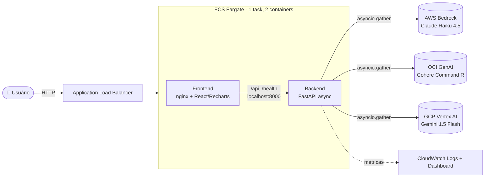

# ☁️ Multicloud AI Platform

[](https://github.com/leonardodebs/multicloud-ai-platform/actions/workflows/ci.yml)

Interface unificada que consulta **AWS Bedrock**, **OCI Generative AI** e
**GCP Vertex AI** *simultaneamente*, com três modos de operação:
**comparar**, **consenso** e **mais rápido**.

Projeto definitivo de portfólio para vagas sênior de **Cloud / DevOps Engineer** —
demonstra IA multicloud, FastAPI assíncrono, Docker, ECS Fargate, ECR,
Terraform, GitHub Actions com OIDC, React e Recharts.

<!-- LIVE_DEMO_START -->
**🌐 Demo ao vivo:** _(preenchido automaticamente pelo pipeline de deploy após o `terraform apply`)_
<!-- LIVE_DEMO_END -->

> 💡 Roda **ponta-a-ponta sem nenhuma conta de cloud** graças ao **modo demo**:
> `docker-compose up` → http://localhost. Configure credenciais reais quando
> quiser consultar os modelos de verdade.

---

## 🏗️ Arquitetura



O backend dispara as três consultas **em paralelo** (`asyncio.gather`),
mede latência/tokens/custo de cada uma e devolve tudo numa resposta única.
Nenhum provider levanta exceção — falhas viram um campo `error` no resultado,
mantendo a chamada resiliente mesmo se um cloud cair.

---

## 🚀 Quickstart (sem AWS/ECS)

Pré-requisitos: Docker + Docker Compose.

```bash
git clone <este-repo>
cd multicloud-bridge
docker-compose up --build
# Abra http://localhost
```

Pronto. A interface sobe em modo demo (respostas sintéticas, latências
simuladas distintas por cloud) — perfeito para demonstrar a UI, os gráficos e
os três modos sem gastar nada.

Para usar os **modelos reais**, copie `.env.example` para `.env`, preencha as
credenciais e defina `DEMO_MODE=false`.

### Desenvolvimento com hot reload

```bash
docker-compose -f docker-compose.dev.yml up
# Backend (uvicorn --reload):  http://localhost:8000
# Frontend (Vite HMR):         http://localhost:5173
```

---

## 🎛️ Modos de operação

| Modo            | Endpoint            | O que faz                                                              |
| --------------- | ------------------- | --------------------------------------------------------------------- |
| **Comparar**    | `mode: "compare"`   | Consulta os clouds em paralelo e mostra as respostas lado a lado.     |
| **Consenso**    | `mode: "consensus"` | Consulta todos e usa o **Claude** para sintetizar uma resposta única. |
| **Mais rápido** | `mode: "fastest"`   | Retorna a **primeira** resposta válida e cancela as demais.           |

### Como funciona o modo Consenso

1. O orquestrador dispara as três consultas **em paralelo** com `asyncio.gather`.
2. Coleta todas as respostas bem-sucedidas.
3. Monta um **meta-prompt** que apresenta a pergunta original + as respostas de
   cada modelo e pede uma síntese coerente.
4. Envia esse meta-prompt ao **Claude (AWS Bedrock)**, que resolve contradições
   e combina os melhores pontos de cada resposta numa única.
5. Devolve a síntese **junto** com as respostas individuais, para você comparar
   o consenso com cada fonte.

Em modo demo, a própria resposta sintética do Claude já serve como síntese,
mantendo a demonstração funcional offline.

---

## 📡 API

| Método | Rota      | Descrição                                                      |
| ------ | --------- | ------------------------------------------------------------- |
| `POST` | `/query`  | Consulta multicloud (`compare` / `consensus` / `fastest`).    |
| `POST` | `/rag`    | RAG simples: responde usando documentos fornecidos como contexto. |
| `GET`  | `/health` | Status geral + por cloud (`ok`/`error`). Usado pelo ALB.      |
| `GET`  | `/stats`  | Métricas agregadas de uso (consultas, latência média, custo). |
| `GET`  | `/models` | Modelos disponíveis por cloud.                               |

Exemplo:

```bash
curl -X POST http://localhost/api/query \
  -H 'Content-Type: application/json' \
  -d '{"question":"O que é multicloud?","clouds":["aws","oci","gcp"],"mode":"compare"}'
```

---

## 📊 Comparação de desempenho (execução real, modo demo)

Medições reais coletadas via `docker-compose up` (modo demo, latências
simuladas por cloud para a demonstração):

| Cloud           | Modelo                    | Latência | Tokens | Custo/consulta\* | Qualidade |
| --------------- | ------------------------- | -------- | ------ | ---------------- | --------- |
| GCP Vertex AI   | Gemini 1.5 Flash          | ~485 ms  | 114    | $0.000043        | ★★★★☆     |
| AWS Bedrock     | Claude Haiku 4.5          | ~622 ms  | 117    | $0.000420        | ★★★★★     |
| OCI GenAI       | Cohere Command R          | ~881 ms  | 116    | $0.000300        | ★★★★☆     |

\* Custo estimado pelos preços públicos por 1M de tokens
(input/output): Claude Haiku 4.5 $1.00/$5.00 · Cohere Command R $0.50/$1.50 ·
Gemini 1.5 Flash $0.075/$0.30. Em produção os valores refletem o uso real
retornado pelos SDKs.

**Leitura:** o Gemini Flash tende a ser o mais rápido e barato; o Claude Haiku
costuma dar a resposta mais detalhada (maior "qualidade"); o modo *consenso*
combina o melhor dos três.

---

## 🤔 Por que multicloud?

- **Sem vendor lock-in** — a mesma interface fala com qualquer um dos três
  clouds via o padrão de *provider abstrato*. Trocar/adicionar um provedor é
  uma classe nova, não uma reescrita.
- **Otimização de custo** — você enxerga custo por consulta lado a lado e pode
  rotear cargas para o modelo mais barato que atende à qualidade necessária.
- **Resiliência** — se um cloud falhar ou ficar lento, os outros respondem; o
  modo *mais rápido* sempre entrega a menor latência disponível e os erros
  nunca derrubam a requisição.

---

## 💰 Custo da infraestrutura (~$10/mês)

| Item                          | Estimativa mensal | Observação                                  |
| ----------------------------- | ----------------- | ------------------------------------------- |
| ECS Fargate (0.25 vCPU/512MB) | ~$9               | 1 task contínua (`desired_count = 1`)       |
| Application Load Balancer     | ~variável         | custo-hora + LCU (principal componente)     |
| ECR (2 repositórios)          | ~$0.10            | só as 10 imagens mais recentes (lifecycle)  |
| CloudWatch Logs + Dashboard   | ~$0.50            | retenção de 14 dias                         |
| Secrets Manager (2 secrets)   | ~$0.80            | $0.40/secret/mês                            |
| **APIs de IA**                | **sob demanda**   | pago por token consumido (tabela acima)     |

> Usa a **VPC default** e subnets públicas (sem NAT Gateway) para manter o
> custo baixo. O componente dominante costuma ser o ALB.

---

## 🔧 Stack & estrutura

```
backend/            FastAPI async
  providers/        padrão abstrato: base + aws + oci + gcp + demo
  orchestrator.py   asyncio.gather, consenso, mais rápido, custo
  main.py           endpoints /query /rag /health /stats /models
  tests/            pytest (23 testes, mock dos 3 providers)
frontend/           React + Recharts (Vite)
  src/components/   CloudSelector, ModeSelector, QueryInput, ResultCards,
                    LatencyChart, CostDisplay, StatsDashboard, HealthIndicator
Dockerfile.backend  python:3.12-slim, multi-stage, uvicorn
Dockerfile.frontend node:20 build → nginx:alpine serve
docker-compose.yml  backend(8000) + frontend(80, nginx reverse proxy)
terraform/          ECS Fargate, ECR, ALB, Secrets Manager, CloudWatch, OIDC
.github/workflows/  ci.yml (testes + trivy + checkov + tf validate)
                    deploy.yml (OIDC → build/push ECR → tf apply → smoke test)
```

---

## 🔁 CI/CD

- **`ci.yml`** — `pytest` no backend, `eslint` + `vitest` + build no frontend,
  `trivy fs` (CVEs), `checkov` (IaC) e `terraform validate`.
- **`deploy.yml`** — autentica via **GitHub OIDC** (sem credenciais
  armazenadas), faz build e push das imagens no **ECR**, roda `terraform apply`
  (atualiza a task definition e o serviço ECS), espera o serviço estabilizar,
  executa o **smoke test** (`GET /health` deve reportar todos os clouds `ok`)
  e atualiza este README com a **URL do demo ao vivo**.

Para habilitar o deploy, configure o secret `AWS_DEPLOY_ROLE_ARN` no repositório
(ARN da role `multicloud-ai-github-deploy`, criada pelo Terraform — veja o
output `github_deploy_role_arn`).

---

## 📚 Documentação

Documentação técnica detalhada em [`docs/`](docs/):

- [Documentação de Arquitetura](docs/ARQUITETURA.md) — detalhes técnicos da arquitetura
- [Runbook](docs/RUNBOOK.md) — procedimentos operacionais e troubleshooting
- [Variáveis de Ambiente](docs/VARIAVEIS_DE_AMBIENTE.md) — template e referência de configuração

---

## 🧰 Skills demonstradas

IA multicloud · FastAPI async · Docker (multi-stage) · ECS Fargate · ECR ·
Terraform · GitHub Actions com OIDC · React · Recharts · padrão de provider
abstrato · nginx reverse proxy · CloudWatch · Secrets Manager.

---

## ✅ Testes

```bash
# Backend (23 testes, modo demo — sem rede)
cd backend && pip install -r requirements.txt && DEMO_MODE=true pytest -q

# Frontend (lint + testes de componentes + build)
cd frontend && npm install && npm run lint && npm test && npm run build
```
