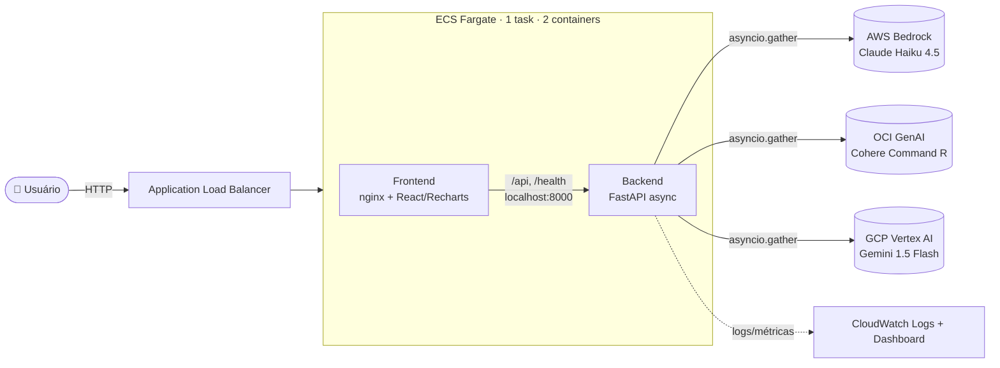

# 🏗️ Documentação de Arquitetura

Detalhes técnicos da **Multicloud AI Platform** — a interface unificada que
consulta AWS Bedrock, OCI GenAI e GCP Vertex AI simultaneamente.

---

## 1. Visão geral

A plataforma expõe **uma única API** que dispara consultas em paralelo para três
provedores de IA generativa e devolve as respostas comparadas (latência, tokens,
custo). É composta por:

- **Backend** FastAPI assíncrono (Python 3.12)
- **Frontend** React + Recharts (servido por nginx, que também atua como reverse proxy)
- **Infraestrutura** em AWS ECS Fargate provisionada por Terraform
- **CI/CD** com GitHub Actions (deploy via OIDC, sem credenciais armazenadas)

### Diagrama de alto nível



---

## 2. Backend

### 2.1 Padrão de Provider Abstrato

O coração do projeto. Cada nuvem implementa o **mesmo contrato**, então o resto
do sistema trata AWS, OCI e GCP de forma idêntica.

```
providers/
├── base_provider.py   # classe abstrata + ProviderResult
├── aws_provider.py     # boto3 bedrock-runtime  (Claude Haiku 4.5)
├── oci_provider.py     # oci.generative_ai_inference (Cohere Command R)
├── gcp_provider.py     # vertexai.generative_models (Gemini 1.5 Flash)
├── demo.py             # respostas sintéticas (modo offline)
└── __init__.py         # registro PROVIDERS = {"aws":..., "oci":..., "gcp":...}
```

**`BaseProvider`** centraliza o comportamento comum, e cada subclasse implementa
apenas `_invoke()` (a lógica específica do SDK):

| Responsabilidade | Onde fica |
| ---------------- | --------- |
| Medição de latência (`time.perf_counter`) | base |
| Timeout de 30s (`asyncio.wait_for`) | base |
| 2 retentativas em erros transitórios (backoff exponencial) | base |
| Cálculo de custo (preço por 1M tokens) | base |
| **Contrato "nunca levanta exceção"** | base |
| Chamada real ao SDK | subclasse (`_invoke`) |

**`ProviderResult`** é o resultado padronizado retornado por todos:

```python
ProviderResult(
    cloud,        # "aws" | "oci" | "gcp"
    answer,       # texto da resposta (None em erro)
    model,        # ID do modelo
    latency_ms,   # latência ponta-a-ponta
    tokens,       # input + output
    cost_usd,     # custo estimado
    error,        # mensagem de erro (None em sucesso)
)
```

> **Decisão de design:** os providers **nunca propagam exceção**. Uma falha vira
> o campo `error` no resultado. Isso mantém o `asyncio.gather()` do orquestrador
> sempre completando, mesmo que um cloud caia — base da resiliência multicloud.

### 2.2 Concorrência (async)

Os SDKs das nuvens são **síncronos/bloqueantes**. Para não travar o event loop,
cada `_invoke()` roda a chamada do SDK em uma thread (`asyncio.to_thread`),
enquanto o `BaseProvider.query()` aplica timeout e retries de forma assíncrona.
O orquestrador então dispara os três `query()` com `asyncio.gather`.

### 2.3 Orquestrador

`orchestrator.py` instancia um provider por nuvem (reuso de clientes SDK) e
implementa os três modos:

| Método | Modo | Estratégia |
| ------ | ---- | ---------- |
| `query_parallel(clouds, prompt)` | **comparar** | `asyncio.gather` → dict `{cloud: ProviderResult}` |
| `query_consensus(clouds, prompt)` | **consenso** | paralelo + meta-prompt sintetizado pelo Claude |
| `query_fastest(clouds, prompt)` | **mais rápido** | `asyncio.wait(FIRST_COMPLETED)`, cancela os demais |
| `calculate_total_cost(results)` | — | soma `cost_usd` de todos |
| `health()` | — | status `ok`/`error` por cloud |

**Fluxo do modo consenso:**

1. `query_parallel` consulta todas as nuvens em paralelo.
2. Filtra as respostas bem-sucedidas.
3. Monta um meta-prompt: pergunta original + respostas de cada modelo.
4. Envia ao **Claude (AWS Bedrock)** para sintetizar uma resposta única.
5. Retorna a síntese + os resultados individuais.

**Fluxo do modo mais rápido:**

1. Cria uma task por nuvem.
2. `asyncio.wait(..., return_when=FIRST_COMPLETED)` em loop.
3. Na primeira resposta **válida**, cancela as pendentes e retorna.
4. Se uma falhar rápido, segue esperando as outras (ignora a falha).

### 2.4 API (FastAPI)

| Método | Rota | Descrição |
| ------ | ---- | --------- |
| `POST` | `/query` | `{question, clouds, mode}` → resultados (+ `consensus` no modo consenso) |
| `POST` | `/rag` | `{question, cloud, documents}` → resposta com contexto injetado + `sources` |
| `GET` | `/health` | `{status, clouds:{aws,oci,gcp}}` — usado pelo health check do ALB |
| `GET` | `/stats` | métricas agregadas (em memória) |
| `GET` | `/models` | modelos disponíveis por cloud |

As estatísticas (`Stats`) são mantidas **em memória** no processo: total de
consultas, por cloud, por modo, latência média, custo total e consultas do dia.
Resetam ao reiniciar o container (suficiente para um dashboard de demonstração;
em produção iriam para um datastore).

CORS está liberado (`*`) porque em produção o nginx serve frontend e API na
mesma origem; em dev o proxy do Vite cuida disso.

### 2.5 Modo Demo

Sem credenciais de cloud (ou com `DEMO_MODE=true`), cada provider cai em
`demo.py`, que devolve respostas sintéticas com **latências simuladas distintas
por cloud** (AWS ~350–650ms, OCI ~500–950ms, GCP ~250–550ms). Isso permite
`docker-compose up` funcionar ponta-a-ponta **sem nenhuma conta de nuvem** e
deixa os gráficos/modos realistas na demonstração.

A detecção é automática: se o SDK não inicializa, falta credencial resolvível,
ou faltam variáveis obrigatórias (ex.: `OCI_COMPARTMENT_ID`, `GCP_PROJECT_ID`),
o provider entra em demo individualmente.

---

## 3. Frontend

React + Recharts, empacotado pelo Vite e servido por nginx.

```
src/
├── App.jsx                  # orquestra estado e componentes
├── api.js                   # cliente HTTP (todas as rotas via /api)
├── constants.js             # metadados dos clouds (cores, rótulos) e modos
└── components/
    ├── CloudSelector.jsx    # checkboxes AWS/OCI/GCP + badge de latência
    ├── ModeSelector.jsx     # comparar/consenso/mais rápido (tooltip)
    ├── QueryInput.jsx       # textarea + Ctrl+Enter
    ├── ResultCards.jsx      # respostas lado a lado + estrelas de qualidade
    ├── LatencyChart.jsx     # barras horizontais (Recharts)
    ├── CostDisplay.jsx      # custo total + breakdown por cloud
    ├── StatsDashboard.jsx   # totais e cloud mais usado
    └── HealthIndicator.jsx  # bolinhas verde/amarelo/vermelho por cloud
```

A "qualidade" em estrelas no `ResultCards` é uma **heurística** que combina o
tamanho da resposta (detalhe) e a latência relativa — não é uma avaliação do
modelo, apenas um indicador comparativo visual.

---

## 4. Camada de rede / nginx

O container do frontend roda nginx que faz **duas funções**:

1. Serve os arquivos estáticos da SPA (com fallback `try_files → index.html`).
2. Atua como **reverse proxy**: `/api/*` e `/health` → backend.

O upstream é parametrizado por `${BACKEND_HOST}:${BACKEND_PORT}` via template
(`nginx/frontend.conf.template`). A imagem oficial do nginx roda `envsubst` no
boot, então a **mesma imagem** funciona em:

| Ambiente | `BACKEND_HOST` | Como o backend é alcançado |
| -------- | -------------- | -------------------------- |
| docker-compose | `backend` | nome do serviço na rede do compose |
| ECS Fargate | `127.0.0.1` | mesma task (rede `awsvpc` → localhost) |

---

## 5. Containerização

| Arquivo | O que faz |
| ------- | --------- |
| `Dockerfile.backend` | multi-stage: `python:3.12-slim` builder (venv) → runtime enxuto, usuário não-root, healthcheck no `/health` |
| `Dockerfile.frontend` | `node:20` build do Vite → `nginx:alpine` servindo `dist/` + template |
| `docker-compose.yml` | produção local: backend(8000) + frontend(80, configurável via `FRONTEND_PORT`) |
| `docker-compose.dev.yml` | hot reload: uvicorn `--reload` + Vite HMR (5173) |

---

## 6. Infraestrutura (Terraform / AWS)

Provisiona um demo de baixo custo (~$10/mês). Arquivos em `terraform/`:

| Arquivo | Recursos |
| ------- | -------- |
| `network.tf` | usa **VPC default** + subnets públicas (sem NAT Gateway); SGs do ALB e ECS |
| `ecr.tf` | 2 repositórios (backend, frontend) + lifecycle (10 imagens) |
| `iam.tf` | execution role, task role (Bedrock), provider OIDC + role de deploy |
| `secrets.tf` | Secrets Manager para credenciais OCI e GCP |
| `alb.tf` | ALB + target group (`type=ip`) + listener; health check `GET /health` |
| `ecs.tf` | cluster + task definition (2 containers) + service |
| `cloudwatch.tf` | log groups + dashboard (CPU/memória ECS, requisições/latência ALB) |
| `outputs.tf` | `alb_dns_name` (URL do demo) e outros |

### Topologia ECS

Uma **única task** com **dois containers** (rede `awsvpc`):

```
┌─ ECS Task (0.25 vCPU / 512 MB) ───────────────────┐
│  ┌─ frontend (nginx :80) ─┐  ┌─ backend (:8000) ─┐ │
│  │ memory 128             │→ │ memory 384         │ │
│  │ BACKEND_HOST=127.0.0.1 │  │ DEMO_MODE, region  │ │
│  │ dependsOn backend      │  │ task role → Bedrock│ │
│  └────────────────────────┘  └────────────────────┘ │
└────────────────────────────────────────────────────┘
        ▲ ALB → frontend:80 (health /health → proxy → backend)
```

- `desired_count = 1`, `assign_public_ip = true` (puxar imagens do ECR sem NAT).
- O frontend só inicia após o backend ficar **HEALTHY** (`dependsOn`).
- **AWS** usa a **task role** para o Bedrock (sem chave estática). **OCI/GCP**
  recebem credenciais via Secrets Manager.

### Identidade e segurança

- **GitHub OIDC**: o pipeline assume uma role temporária via web identity —
  **sem credenciais AWS armazenadas** no repositório.
- SG do ECS aceita tráfego na 80 **apenas do SG do ALB**.
- Imagens com scan no push (ECR `scan_on_push`).

---

## 7. CI/CD

| Workflow | Gatilho | Passos |
| -------- | ------- | ------ |
| `ci.yml` | push / PR | pytest (backend) · eslint+vitest+build (frontend) · trivy (CVEs) · checkov (IaC) · terraform validate |
| `deploy.yml` | push em `main` / manual | OIDC → build+push ECR → terraform apply → wait services-stable → smoke test `/health` → atualiza README com URL |

O deploy é **totalmente dirigido pelo Terraform**: novas imagens geram uma nova
revisão da task definition, o service é atualizado e o ECS faz rolling deploy.

---

## 8. Fluxo de uma requisição (modo comparar)

```
1. Navegador → GET http://<alb>/ ............... nginx serve a SPA
2. SPA → POST /api/query {question, clouds, mode}
3. nginx → proxy → backend:8000/query
4. main.py valida (Pydantic) e chama orchestrator.query_parallel
5. orchestrator → asyncio.gather(aws.query, oci.query, gcp.query)
   ├─ cada provider: timeout 30s, 2 retries, mede latência/tokens/custo
   └─ falhas viram error no ProviderResult (não derrubam o gather)
6. main.py agrega custo, registra Stats e responde JSON
7. SPA renderiza ResultCards + LatencyChart + CostDisplay
```

---

## 9. Decisões de arquitetura (resumo)

| Decisão | Motivo |
| ------- | ------ |
| Provider abstrato | trocar/adicionar nuvem é uma classe, não uma reescrita (sem lock-in) |
| Providers nunca levantam exceção | resiliência: uma nuvem fora não quebra a requisição |
| Modo demo | rodar e demonstrar sem nenhuma conta de cloud |
| 2 containers em 1 task | comunicação via localhost, 1 target group, custo mínimo |
| VPC default sem NAT | manter ~$10/mês |
| OIDC no deploy | sem segredos AWS estáticos no GitHub |
| nginx com template | uma imagem serve compose e ECS |
